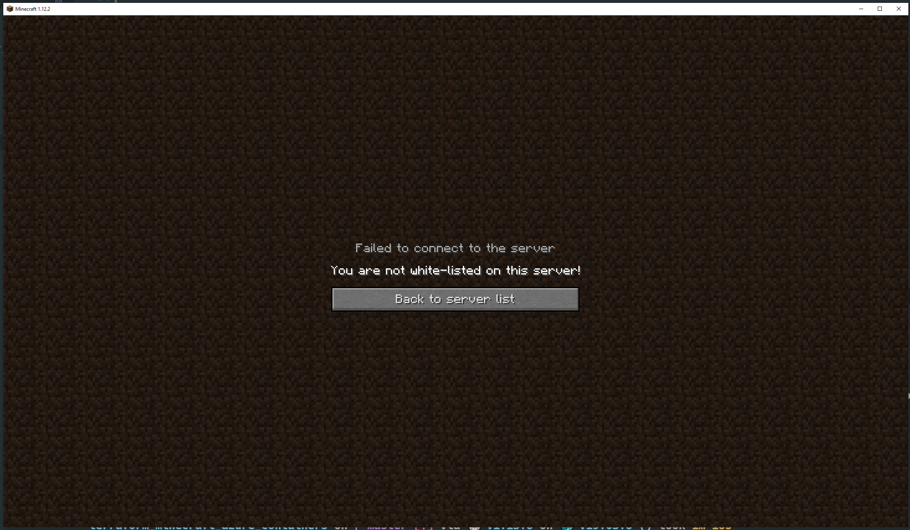
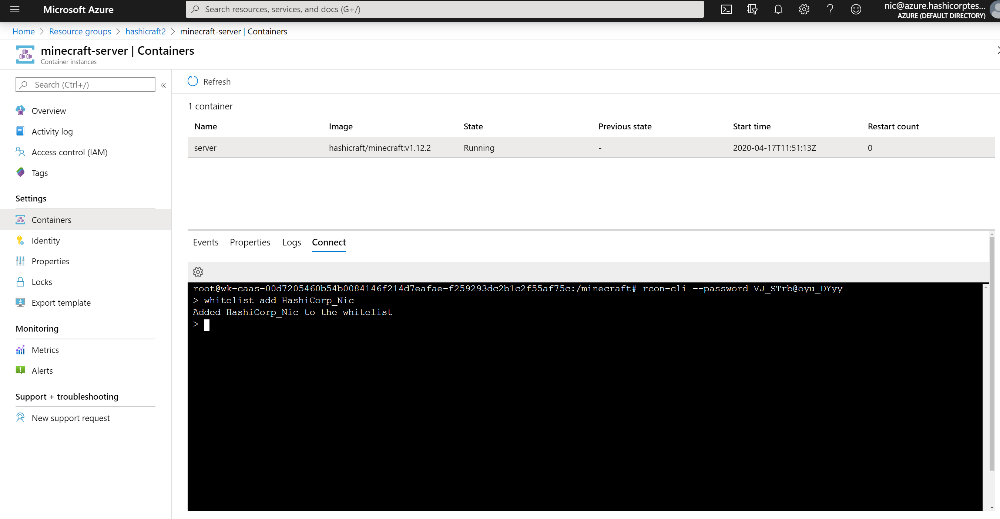

# terraform_minecraft_azure_containers
Example code showing how to deploy a Minecraft server to Azure Containers


## Setup

To create resources in Azure using Terraform you need to be authenticated, follow the guide at terraform.io to obtain the required
credentials. [https://www.terraform.io/docs/providers/azurerm/guides/azure_cli.html](https://www.terraform.io/docs/providers/azurerm/guides/azure_cli.html)

```shell
export ARM_CLIENT_ID="xxxx-x-xxx--xx-x-x-xxxxx"
export ARM_CLIENT_SECRET="xxxx-xxxx-xxxx-xxx-x-xx"
export ARM_SUBSCRIPTION_ID="xxxx-xxxx-xxxx-x-xxx"
export ARM_TENANT_ID="xxxx-xxx-x-xx-xxxx"
```

[https://youtu.be/zL4Xt7CyuDE?t=275](https://youtu.be/zL4Xt7CyuDE?t=275)

Once you have set your credentials as environment variables you can run the `terraform init` command to download any required providers and setup Terraform.

```
➜ terraform init

Initializing the backend...

Initializing provider plugins...
- Checking for available provider plugins...
- Downloading plugin for provider "azurerm" (hashicorp/azurerm) 2.5.0...
```

[https://youtu.be/zL4Xt7CyuDE?t=482](https://youtu.be/zL4Xt7CyuDE?t=482)

## Run a plan

Next step is to run a plan, a plan will tell you the changes that Terraform is about to make.

```
➜ terraform plan
Refreshing Terraform state in-memory prior to plan...
The refreshed state will be used to calculate this plan, but will not be
persisted to local or remote state storage.


------------------------------------------------------------------------

An execution plan has been generated and is shown below.
Resource actions are indicated with the following symbols:
  + create

Terraform will perform the following actions:

  # azurerm_container_group.minecraft will be created
  + resource "azurerm_container_group" "minecraft" {
      + dns_name_label      = "tfdemohs"
```

[https://youtu.be/zL4Xt7CyuDE](https://youtu.be/zL4Xt7CyuDE)

## Apply changes

If you are happy that the plan is what you need then the next step is to apply the changes and create the resources.

```
➜ terraform apply

An execution plan has been generated and is shown below.
Resource actions are indicated with the following symbols:
  + create

Terraform will perform the following actions:

  # azurerm_container_group.minecraft will be created
  + resource "azurerm_container_group" "minecraft" {
#...
Groups/hashicraft2/providers/Microsoft.ContainerInstance/containerGroups/minecraft-server]

Apply complete! Resources: 2 added, 0 changed, 0 destroyed.

Outputs:

fqdn = tfdemohs.westeurope.azurecontainer.io
```

[https://youtu.be/zL4Xt7CyuDE?t=559](https://youtu.be/zL4Xt7CyuDE?t=559)

## Accessing the Minecraft server
Your new Minecraft server is running on the internet and is accessible using the `FQDN` output from terraform and the port `25565`. For if the FQDN is `tfdemohs.westeurope.azurecontainer.io` you can the server in your minecraft application `tfdemohs.westeurope.azurecontainer.io:25565`.

y default no player have access to log in. To allow a login a player must be whitelisted.



To white list a player you can log into the server using the terminal in Azure Container Instances. 



In the terminal first start the `rcon-cli`

```
rcon-cli --password <PASSWORD FROM TERRAFORM OUTPUT>
```

Then use the `whitelist` command to add your user replacing `<USER>` with the name of your Minecraft user

```
whitelist add <USER>
```

If all is successful you should now be able to log into the remote server


[https://youtu.be/zL4Xt7CyuDE?t=1634](https://youtu.be/zL4Xt7CyuDE?t=1634)

## Cleaning up

To delete the server you can use the `terraform destroy` command. `terraform destroy` will remove any of the resources that you defined in the config.

```
➜ terraform destroy
random_password.password: Refreshing state... [id=none]
azurerm_resource_group.minecraft: Refreshing state... [id=/subscriptions/28xxx32-cb76-xx-ba61-5eef6xxx422/resourceGroups/hasicrafttest]
azurerm_container_group.minecraft: Refreshing state... [id=/subscriptions/28xxx32-cb76-xx-ba61-5eef6xxx422/resourceGroups/hasicrafttest/providers/Microsoft.ContainerInstance/containerGroups/minecraft]

An execution plan has been generated and is shown below.
Resource actions are indicated with the following symbols:
  - destroy

Terraform will perform the following actions:

  # azurerm_container_group.minecraft will be destroyed
#...
azurerm_resource_group.minecraft: Still destroying... [id=/subscriptions/28xxx32-cb76-xx-ba61-5eef6xxx422/resourceGroups/hasicrafttest, 40s elapsed]
azurerm_resource_group.minecraft: Destruction complete after 46s

Destroy complete! Resources: 3 destroyed.
```

[https://youtu.be/zL4Xt7CyuDE?t=1789](https://youtu.be/zL4Xt7CyuDE?t=1789)

## Note
This repository runs Terraform in local mode, local mode writes the Terraform state to the local disk using the files `terraform.tfstate` and `terraform.tfstate.backup`. These files can contain secret information such as usernames and passwords and should NOT be uploaded to a public GitHub repository.